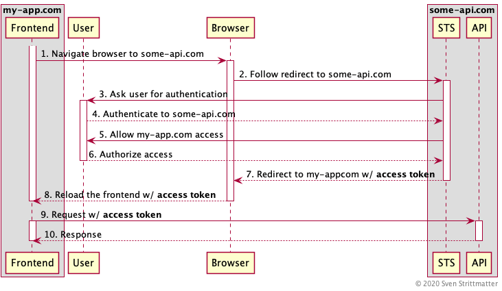
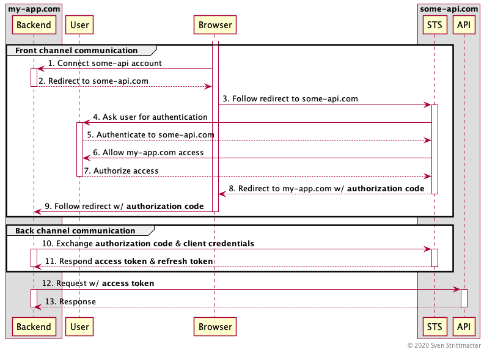
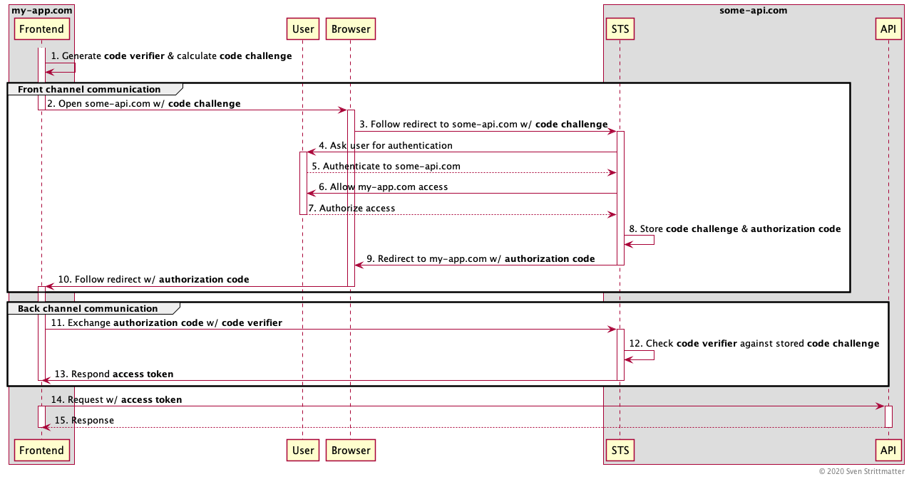

Certainly I'm not the only one writing into the web that _OAuth 2.0 Implicit Flow_ is bad for security reasons and deprecated by [OAuth 2.0 Best Current Practices][oauth20-bcp] and [OAuth 2.1][oauth21]. But this can't be said enough times. So I'll try my best! This post is a guide for people facing situations where random dudes asking "Why should I bother? [See, Microsoft is recommending it!][ms-impl-flow]" After reading this post you can tell them why it is a bad idea to use _implicit flow_.

## How Does Implicit Flow Work?

The _OAuth 2.0 Implicit Flow_ is from ancient times when we only had limited browsers. Maybe you're young enough and never faced the massive pain to support something like Internet Explorer 6. This was a dark time you can't do simply cross-origin HTTP requests without jumping backwards through burning hoops and sacrifice a kitten. So _OAuth 2.0 Implicit Flow_ was designed to work with sole browser redirects.

Let's examine a brief example of _OAuth 2.0 Implicit Flow_:

In the above sequence diagram you see the flow for  a frontend application hosted at `https://www.my-app.com` which want to access an API at `https://www.some-api.com` and therefore need an _access token_ from the _security token service_ (STS) responsible for this API. For the sake of brevity we assume that both the API and STS are hosted at the same domain.

As you can see there are going lot of redirects back and forth. First the fronted application will redirect you to `some-api.com` to authenticate there (step one and two). If it is a mobile app it will open a system browser for redirecting. Why is this done there and not inside the frontend application? The reason is you do not trust the frontend application and do not want to give it the credentials for `some-api.com`. This is also the reason why mobile apps **must** open a browser for authentication and can't provide an own login mask. Although the customer or designer dislikes this and judge it an ugly user experience. After redirected to the _STS_ it presents you the login for authentication (Step three and four). If authenticated successfully the _STS_ presents a so called _consent dialog_ (step five and six). This _consent dialog_ is the typical dialog with a message like: "do you want to allow my-app.com to access your data at some-api.com?"

Then the _STS_ issues the _access token_ and redirects back to `my-app.com` with the token appended to the URL as a fragment. This reloads the frontend application and populates it with the _access token_. And then the application can use it to request the API.

## Why Is Implicit Flow Bad?

**Disclaimer**: I will not go into the problems not using TLS. Nowadays there is absolutely no good reason for not using TLS everywhere! Unless you use TLS, stop reading immediately and fix that first!

### Ups, Posted the Entire URL

You know these dudes sending the whole URL with all query parameters and fragments via email or chat to tell you what they found in the internet. Despite the fact that they may leak a lot of data about them you may suspect what the problem with the _access token_ in URLs is: If this URL leaves the browser tab in any way, anyone can use the token from the URL to access the API. Let me illustrate this by an example:

You're sitting in the internet cafe at a shared computer and visit your loved `my-app.com` and do your business there. After you closed the browser and left the cafe I come in and search through the browser history. Gotcha! I have your token and can do things now in your behalf. To circumvent this one could rewrite the browsers location and history after step eight in the sequence above. But this is a quite cumbersome mitigation which may fail for various reasons.

### Oh, Look This Funny Furt App

A more sophisticated attack may happen at mobile devices. With a mobile application as frontend the whole redirect stuff from the sequence above involves the system's browser and app redirects. This means that your frontend app need to register for the call back URL used in step seven in the sequence above. In our example that would be `my-app.com`. So when the systems browser received a redirect to an URL with `my-app.com` it leaves the browser and opens the app and hand over the URL with the token.

Now imagine that someone place a malicious app on your phone which also registers for this URL and intercepts the token: Gotcha! I don't have very deep knowledge in the field of mobile app development and maybe there are also some mitigations to this attack vector. But this does not really matter because you **must not** use _implicit flow_!

## What Is the Alternative?

The alternative is the _OAuth 2.0 Authorization Code Flow with PKCE_. (Hint: The OAuth 2.0 dudes pronounce this "PKCE" thingy "pigsi".) So first: For what stands PKCE? This is the abbreviation for _Proof Key for Code Exchange_. Ok, didn't give as any hint how it works. First I give a short introduction how _OAuth 2.0 Authorization Code Flow_ works and then describe why we need this "pigsi" thingy and how it works.

### OAuth 2.0 Authorization Code Flow

We use the same example as above with our app hosted at `https://www.my-app.com` and an API we integrate hosted at `https://www.some-api.com`. Here is the full sequence of the _code flow_:

The first seven steps are merely identical to the _implicit flow_. The main difference here is that we do not hve a frontend but a backend in this diagram. Of course does `my-app.com` also have a frontend, but this is rendered by the backend and does not play any role in the _authorization code flow_. Also a difference here is that step one is "Connect  some-api account". This is like the "connect GitHub/Twitter/Facebook/Whatever"-buttons you may have seen at other sites.

The big difference in this diagram to the previous one is that we distinguish the back and forth communication in two kinds:

1. The _front channel communication_: This is all the authorization communication done via the insecure user side channel (eg. at computers browser). Why insecure? Because you have no control over this communication channel. You don't know if there is some malware or someone eavesdropping this communication.
2. The _back channel communication_: This is all the authorization communication between backend and _STS_. This is considered secure because you have control over the backend and you must trust the _STS_ anyway. Also you may use [mTLS][wiki-mtls] to authenticate both parties (backend and _STS_) to each other.

If you look closely you may recognized that step nine does not redirect with an _access token_, but with an _authorization code_. That's hence where the name _authorization code flow_ come from. With this _authorization code_ you can't access the API. It is only used by the backend to authorize against the _STS_ in combination with the _client credentials_. The _client credentials_ are the backend's "username and password" for the _STS_. The _STS_ will return the _access token_ and a _refresh token_, if _authorization code_ and _client credentials_ were valid. And then the backend may access the API with the _access token_.

Why is this more secure than _implicit flow_? The important difference is that the worthy _access token_ is never sent over the insecure _front channel_. Only the _authorization code_ is sent over it and this is only useful in combination with the secret _client credentials_ of the backend. So sniffing this is worthless. Ok, if the _client credentials_ leak for any reason then _code flow_ is also doomed. But that's always the case if someone leaks credentials. So keep your _OAuth 2.0 client credentials_ secret or renew them!

### But I Can't Store Client Credentials!

So the _code flow_ from above works really well, if you have a traditional server side web application with a backend where you can store your _client credentials_. But what if you have no such backend because you are a single page or mobile application? PKCE for the rescue!

Some say PKCE is like a one time password. So let's go into the details how it works. For the first sight it looks quite similar to the traditional _code flow_ without PKCE. That's no coincidence because PKCE is just a mechanism on top of _code flow_. The first important thing to realise: There are no _client credentials_ in the play here. Instead the frontend generates a _code verifier_, which must be a [nonce][wiki-nonce] and derives a _code challenge_ with a hash function from it. This _code challenge_ is passed to the _STS_ via the initial _front channel communication_ when obtaining the _authorization code_ and the _STS_ stores this along with the issued _authorization code_. The remaining back and forth is the same as described above in the _code flow_.

The frontend sends the received _authorization code_ together with the plain _code verifier_ via the secure _back channel_ to the _STS_. This verifies it against the  _code challenge_ stored together with the used _authorization code_ by hashing and comparing it. If this verification was successful the _STS_ respond the _access token_ and the frontend can use the API.

You may ask why there is no _refresh token_? Same reason why there are no _client credentials_! With a refresh token you may extend the lifetime of an _access token_ forever without any user interaction. So it is too risky storing it in an unsafe environment like a single page or mobile application. Also _refresh tokens_ are only meant to be used in backends where no user interaction is possible.

## Conclusion

- PKCE is not hard to use and most frameworks or libraries should have it included. So use it! It makes no harm. You can also use it to secure traditional _code flow_ with _client credentials_ additionally.
- Some say that _implicit flow_ is not less safe than it was ever and if suitable you can use it. I say no! And some others like [Dr. Fett][drfett] also say so, and he's one of the dudes writing the RFCs. So he should know.
- Maybe you are confused because I used the terms frontend and backend alternating in the diagrams. This is to illustrate "where" the _OAuth 2.0 client_ resides. The backend is something secured in a datacenter. Frontend is something at an insecure place like a browser or mobile device, but both are _OAuth 2.0 clients_.

Cover image by [MasterTux](https://pixabay.com/users/mastertux-470906) from [Pixabay](https://pixabay.com).

[ms-impl-flow]: https://docs.microsoft.com/en-gb/azure/active-directory/develop/v2-oauth2-implicit-grant-flow
[wiki-mtls]:    https://en.wikipedia.org/wiki/Mutual_authentication
[wiki-nonce]:   https://en.wikipedia.org/wiki/Cryptographic_nonce
[drfett]:       https://twitter.com/dfett42/status/1268977956770193408
[oauth20-bcp]:  https://www.ietf.org/id/draft-ietf-oauth-security-topics-16.html
[oauth21]:      https://oauth.net/2.1/
